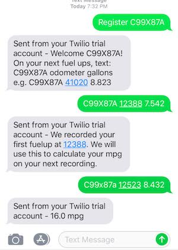

# twilio-mpg

## Try it!
text "register [license plate]"  e.g. "register C99X87A" to the twilio sms number
every fuel up text "\[license plate\] \[odometer\] [gallons\]" and we will track of your fuel economy.

## Technologies
* SMS - twilio
* AWS Lambda
* Firebase realtime DB
* serverless framework
* Node express
* dotenv for .env

## local development
* git clone 
* add a lot of environment variables to `.env` with TWILIO and FIREBASE credentials
* npm start will bring up the webhook available at localhost:3000/fuelup send POST using postman/curl (see twilio docs)
* setup ngrok and twilio phone to test against real sms
* setup aws and severless with all the necessary accounts, cli and credentials  and `serverless deploy` to push to lambda.

### misc
design docs
https://docs.google.com/document/d/1SDXc7SaYgkur_B5I2M14wuFYrYJx4Q3oSN22JHtsm1U/edit?usp=sharing
